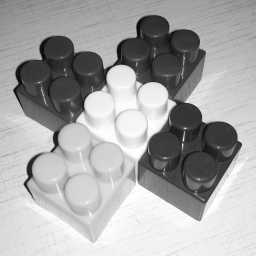
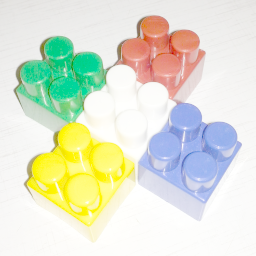

## Работа 3. Яркостные преобразования
автор: Машуров В.В.
дата: 2022-02-27T00:07:33

url: [GitHub - MVVladimir/mashurov_v_v](https://github.com/MVVladimir/mashurov_v_v.git)

### Задание
1. В качестве тестового использовать изображение data/cross_0256x0256.png
2. Сгенерировать нетривиальную новую функцию преобразования яркости (не стоит использовать слишком простые и слишком простые функции).
3. Сгенерировать визуализацию функцию преобразования яркости в виде изображения размером 512x512, черные точки а белом фоне.
4. Преобразовать пиксели grayscale версии тестового изображения при помощи LUT для сгенерированной функции преобразования.
4. Преобразовать пиксели каждого канала тестового изображения при помощи LUT для сгенерированной функции преобразования.
5. Результы сохранить для вставки в отчет.

### Результаты


Рис. 1. Исходное тестовое изображение


Рис. 2. Тестовое изображение greyscale


Рис. 3. Результат применения функции преобразования яркости для greyscale


Рис. 4. Результат применения функции преобразования яркости для каналов


Рис. 5. Визуализация функции яркостного преобразования

### Текст программы

```cpp
#include <opencv2/opencv.hpp>
#include <vector>
#include <cmath>

double f(const double  x) {
    return 45.95 * std::log(x + 1.);
}  

int main() {
    std::string filename = "../data/cross_0256x0256.png";
    cv::Mat img_png = cv::imread(filename, cv::IMREAD_COLOR);

    imwrite("lab03_rgb.png", img_png);

    //========================VISUALIZING=THE=FUNCTION========================

    cv::Mat viz_func(512, 512, CV_8UC1);
    viz_func = 255;

    std::vector<uint8_t> lut256(256);

    for (size_t i = 0; i < lut256.size(); i += 1)
    {
        lut256[i] = std::ceil(f(i));
    }

    for (std::ptrdiff_t i = 0; i < viz_func.cols; i += 1)
    {
        std::cout << viz_func.rows - f(i) << '\n';
        viz_func.at<uint8_t>(viz_func.rows - 1 - f(i) * 1.783, i) = 0;
    }

    imwrite("lab03_viz_func.png", viz_func);

    //========================CONVERTING=TO=GRAYSCALE=AND=SCALING=======================

    cv::Mat img_grey, img_gre_res;

    cv::cvtColor(img_png, img_grey, cv::COLOR_BGR2GRAY);

    cv::LUT(img_grey, lut256, img_gre_res);

    imwrite("lab03_gre_res.png", img_gre_res);
    imwrite("lab03_gre.png", img_grey);

    //=========================SCALING=BGR======================

    cv::Mat rgb_res;

    std::vector<cv::Mat> channels(3);
    cv::split(img_png, channels); // split img to 3 channels - BGR

    cv::LUT(channels[0], lut256, channels[0]);
    cv::LUT(channels[1], lut256, channels[1]);
    cv::LUT(channels[2], lut256, channels[2]);

    cv::merge(channels, rgb_res);

    imwrite("lab03_rgb_res.png", rgb_res);
}
```
