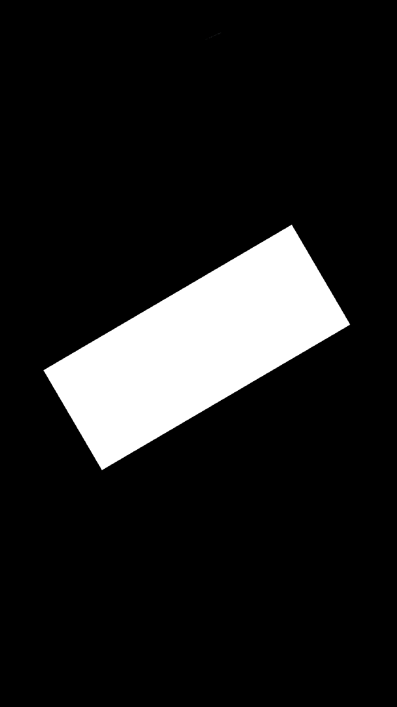
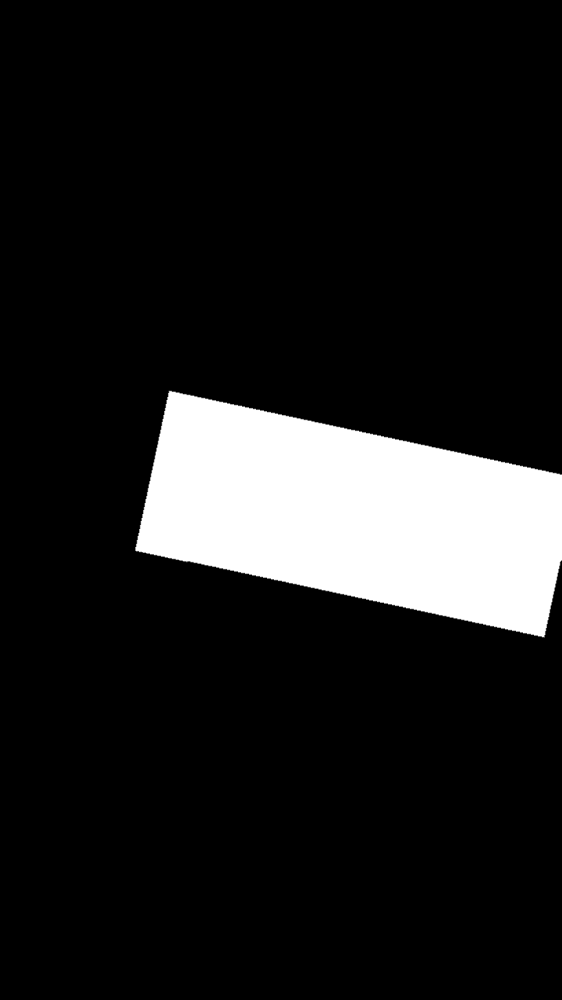
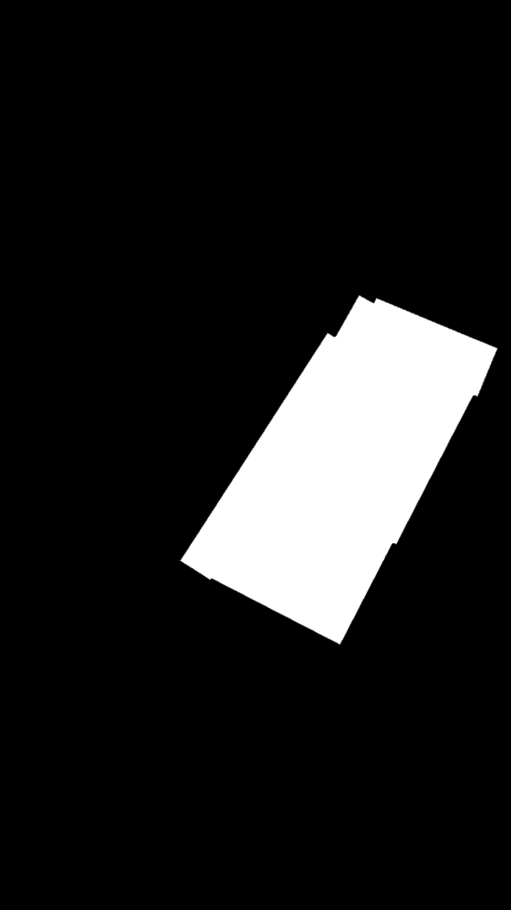
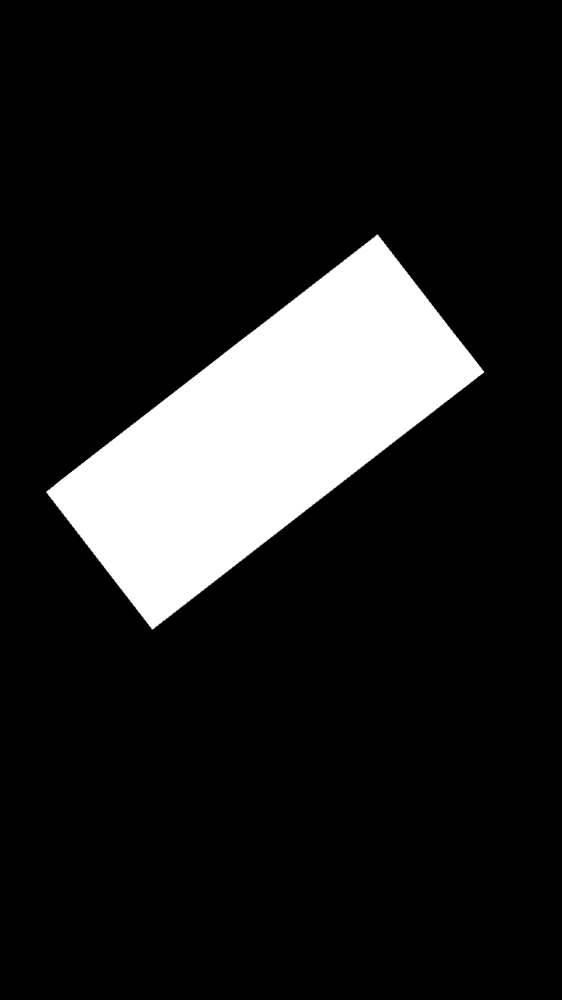
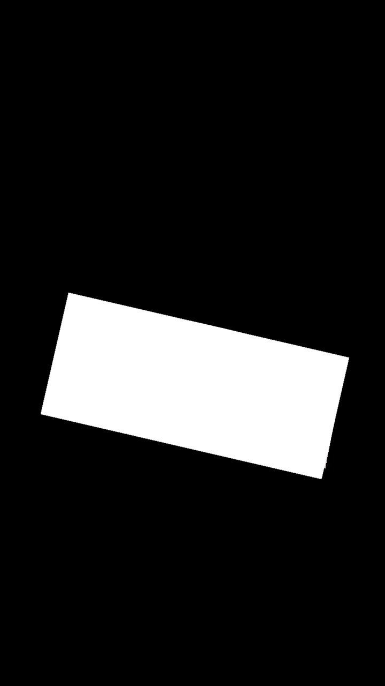
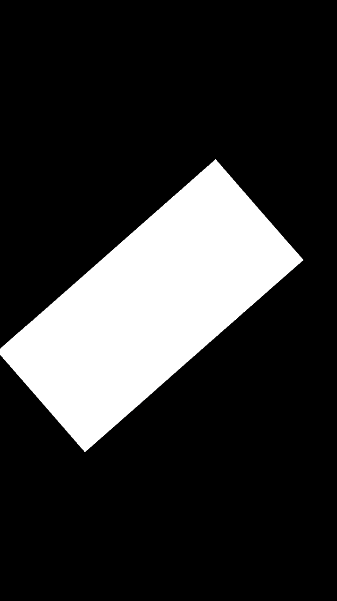
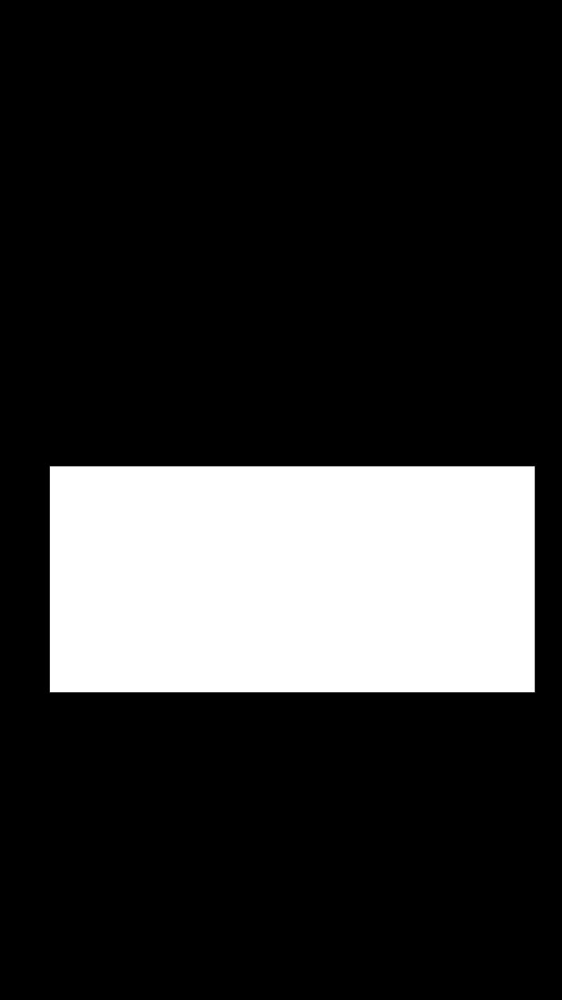

# Работа 4. Детектирование границ документов на кадрах видео
автор: Машуров В.В.
дата: 2022-05-16T11:51:36

## Задание
0. текст, иллюстрации и подписи отчета придумываем самостоятельно
1. самостоятельно снимаем видео смартфоном
- объект съемки - купюры (рубли разного номинала), расправленные и лежащие на поверхности (проективно искаженны прямоугольник)
- количество роликов - от 5 шт.
- длительность - 5-7 сек
- условия съемки разные
2. извлекаем по 3 кадра из каждого ролика (делим кол-во кадров на 5 и берем каждый с индеком 2/5,3/5,4/5)
3. цветоредуцируем изображения
4. бинаризцем изображения
5. морфологически обрабатываем изображения
6. выделяем основную компоненту связности
7. руками изготавливаем маски (идеальная зона купюры)
8. оцениваем качество выделение зоны и анализируем ошибки

## Проделанная работа

Разработан алгоритм детектирования границ документов на кадрах видео.

0. Пути к видеороликам сохраняются в векторе. Далее видеоролики последовательно обрабатываются в специальной функции.
1. Функция, обрабатывающая переданный в неё видеоролик, передаёт кадры в функцию, обрабатывающую отдельные картинки.
2. Функция, обрабатывающая отдельные картинки, делает следующее:
- Производит чёрно-белое изображение, с помощью
```cpp
cv::cvtColor(<цветное изображение>, <чёрно-белое изображение>, cv::COLOR_BGR2GRAY);
 ```
- Бинаризует чёрно-белое изображение, с помощью 
```cpp 
cv::adaptiveThreshold(<чёрно-белое изображение>, <бинаризованное изображение>, 256.0, cv::ADAPTIVE_THRESH_MEAN_C, cv::THRESH_BINARY_INV, 201, 25.0);
```
- Производит морфологию бинаризованного изображения, с помощью: 
```cpp
    cv::morphologyEx(<бинаризованное изображение>, <морфологически обработанное изображение>, cv::MORPH_CLOSE, getStructuringElement(cv::MORPH_RECT, cv::Size(100, 100)));
```
3. Все созданные изображения и их сравнения переносятся в соответствующие директории. Для эксперимента из 5 видеороликов берётся по 3 кадра. Полученные маски сравниваются с "эталонными", в таблице ниже в колонке "сравнение":
- белый -- совпадение границ документа.
- чёрный -- совпадение фона изображения.
- красный -- неверно детектированные границы документа.
- синий - неверно детектированный фон документа.

## Исходные данные

<table>
    <thead>
        <tr>
            <td>Номер</td>
            <td>Исх. картинка</td>
            <td>Чёрно-белая</td>
            <td>Бинар.</td>
            <td>Морфология</td>
            <td>Сравнение</td>
            <td>Маска (Эталон)</td>
        </tr>
    </thead>
    <tbody>
        <tr>
            <td>50р-1</td>
            <td>  </td>
            <td>  </td>
            <td>  </td>
            <td>  </td>
            <td>  </td>
            <td>  </td>
        </tr>
        <tr>
            <td>50р-2</td>
            <td>  </td>
            <td>  </td>
            <td>  </td>
            <td>  </td>
            <td>  </td>
            <td>  </td>
        </tr>
        <tr>
            <td>50р-3</td>
            <td>  </td>
            <td>  </td>
            <td>  </td>
            <td>  </td>
            <td>  </td>
            <td>  </td>
        </tr>
        <tr>
            <td>100р-1</td>
            <td>  </td>
            <td>  </td>
            <td>  </td>
            <td>  </td>
            <td>  </td>
            <td>  </td>
        </tr>
        <tr>
            <td>100р-2</td>
            <td>  </td>
            <td>  </td>
            <td>  </td>
            <td>  </td>
            <td>  </td>
            <td>  </td>
        </tr>
        <tr>
            <td>100р-3</td>
            <td>  </td>
            <td>  </td>
            <td>  </td>
            <td>  </td>
            <td>  </td>
            <td>  </td>
        </tr>
        <tr>
            <td>500р-1</td>
            <td>  </td>
            <td>  </td>
            <td>  </td>
            <td>  </td>
            <td>  </td>
            <td>  </td>
        </tr>
        <tr>
            <td>500р-2</td>
            <td>  </td>
            <td>  </td>
            <td>  </td>
            <td>  </td>
            <td>  </td>
            <td>  </td>
        </tr>
        <tr>
            <td>500р-3</td>
            <td>  </td>
            <td>  </td>
            <td>  </td>
            <td>  </td>
            <td>  </td>
            <td>  </td>
        </tr>
        <tr>
            <td>1000р-1</td>
            <td>  </td>
            <td>  </td>
            <td>  </td>
            <td>  </td>
            <td>  </td>
            <td>  </td>
        </tr>
        <tr>
            <td>1000р-2</td>
            <td>  </td>
            <td>  </td>
            <td>  </td>
            <td>  </td>
            <td>  </td>
            <td>  </td>
        </tr>
        <tr>
            <td>1000р-3</td>
            <td>  </td>
            <td>  </td>
            <td>  </td>
            <td>  </td>
            <td>  </td>
            <td>  </td>
        </tr>
        <tr>
            <td>5000р-1</td>
            <td>  </td>
            <td>  </td>
            <td>  </td>
            <td>  </td>
            <td>  </td>
            <td>  </td>
        </tr>
        <tr>
            <td>5000р-2</td>
            <td>  </td>
            <td>  </td>
            <td>  </td>
            <td>  </td>
            <td>  </td>
            <td>  </td>
        </tr>
        <tr>
            <td>5000р-3</td>
            <td>  </td>
            <td>  </td>
            <td>  </td>
            <td>  </td>
            <td>  </td>
            <td>  </td>
        </tr>
    </tbody>
</table>

5 видеороликов, находятся в "./data/video<50, 100, 500, 1000, 5000>.mp4". Из каждого программа достала по три кадра и обработала по алгоритму.

## Результаты

Алгоритм предсказывает маску с точностью = 0.62962. Точность вычисляется по формуле правильно_предсказанные_точки_на_всех_картинках / суммарное_количество_точек_на_картинках.
Из сравнений видно, что на однородном документ, противоположного цвета и яркости, лучше детектируется алгоритмом.

## Текст программы

```cpp
#include <opencv2/opencv.hpp>
#include <vector>
#include <cmath>

std::string logs = "";
unsigned long long int rightOnes = 0;

cv::Mat bgrToGrayscale(const cv::Mat& BGR_img ) {
    cv::Mat img_grey;
    cv::cvtColor(BGR_img, img_grey, cv::COLOR_BGR2GRAY);
    return img_grey;
}

cv::Mat binarize(const cv::Mat& grey_img) {
    cv::Mat binarized;
    cv::adaptiveThreshold(grey_img, binarized, 256.0, cv::ADAPTIVE_THRESH_MEAN_C,
        cv::THRESH_BINARY_INV, 201, 25.0);

    return binarized;
}

cv::Mat morphology(const cv::Mat img) {
    cv::Mat morph;
    cv::morphologyEx(img, morph, cv::MORPH_CLOSE, getStructuringElement(cv::MORPH_RECT, cv::Size(100, 100)));
    return morph;
}

void imageProcessing(cv::Mat img_png, const std::string SAVEPATH, const std::string SOURCESPATH) {
    cv::Mat img_grey = bgrToGrayscale(img_png);
    cv::Mat binarized = binarize(img_grey);
    cv::Mat morph = morphology(binarized);
    cv::Mat mask = cv::imread(SOURCESPATH + "mask.png", cv::IMREAD_GRAYSCALE);

    cv::Mat labeled;
    cv::Mat stat, centroids;
    cv::Mat diff = img_png.clone();
    diff = 0;

    cv::connectedComponentsWithStats(morph, labeled, stat, centroids);

    for (size_t i = 0; i < morph.rows; i += 1)
    {
        for (size_t j = 0; j < morph.cols; j += 1)
        {
            if ((mask.at<uint8_t>(i, j) > 0) && (morph.at<uint8_t>(i, j) > 0))
            { //RIGHT WHITE SPACE
                diff.at<cv::Vec3b>(i, j) = cv::Vec3b(255, 255, 255); //WHITE
                rightOnes += 1;
                continue;
            }
            if ((mask.at<uint8_t>(i, j) == 0) && (morph.at<uint8_t>(i, j) == 0))
            { //RIGHT BLACK SPACE
                diff.at<cv::Vec3b>(i, j) = cv::Vec3b(0, 0, 0); //BLACK
                rightOnes += 1;
                continue;
            }
            if ((mask.at<uint8_t>(i, j) == 0) && (morph.at<uint8_t>(i, j) > 0))
            { //WRONG WHITE SPACE
                diff.at<cv::Vec3b>(i, j) = cv::Vec3b(0, 0, 255); //RED
                continue;
            }
            if ((mask.at<uint8_t>(i, j) > 0) && (morph.at<uint8_t>(i, j) == 0))
            { //WRONG BLACK SPACE
                diff.at<cv::Vec3b>(i, j) = cv::Vec3b(255, 0, 0); //BLUE
                continue;
            }
        }
    }

    logs += SAVEPATH + "img_bgr.png" + '\n';

    imwrite(SAVEPATH + "img_bgr.png", img_png);
    imwrite(SAVEPATH + "img_grey.png", img_grey);
    imwrite(SAVEPATH + "binarized.png", binarized);
    imwrite(SAVEPATH + "morph.png", morph);
    imwrite(SAVEPATH + "labeled.png", labeled);
    imwrite(SAVEPATH + "diff.png", diff);
}

// Sorry, I know it's a bad manner but I don't want to look up for docs for this...
std::vector<char> chars = { '0', '1', '2', '3', '4', '5', '6', '7', '8', '9' };
char charIt(int number) {
    return chars.at(number);
}

void videoProcessing(const std::string PATHSOURCES, const std::string FILENAME, const std::string SAVEPATH, const std::ptrdiff_t FRSIZE = 3) {
    cv::VideoCapture capture(PATHSOURCES + FILENAME);
    unsigned long long int video_size = capture.get(cv::CAP_PROP_FRAME_COUNT);
    std::vector<cv::Mat> imgS_png(FRSIZE);

    for (std::ptrdiff_t i = 0, j = 0; j < 3; i += (video_size / 4), j += 1)
    {
       capture.set(cv::CAP_PROP_POS_FRAMES, i);
       capture >> imgS_png.at(j);

       std::string save_to = SAVEPATH + charIt(j + 1) + "/";
       std::string get_from = PATHSOURCES + "masks/" + FILENAME + "/" + charIt(j + 1) + "/";

       imageProcessing(imgS_png.at(j), save_to, get_from);
    }
}

int main() {
    std::vector<std::string> files = { "video50.mp4", "video100.mp4", "video500.mp4", "video1000.mp4", "video5000.mp4" };
    const std::string PATHSOURCES = "../data/";
    const std::string SAVEPATH = "./lab04/";

    for (size_t i = 0; i < files.size(); i += 1) {
        std::string save_path = SAVEPATH + files.at(i) + '/';
        videoProcessing(PATHSOURCES, files.at(i), save_path);
        std::cout << logs;
        logs.clear();
    }

    std::cout << "\nACCURACY = " << rightOnes << " / " << files.size() * 1280 * 720 * 3
        << " = " << ((double)rightOnes / (double)(files.size() * 1280 * 720 * 3)) << '\n' << std::endl;

    return 0;
}
```
