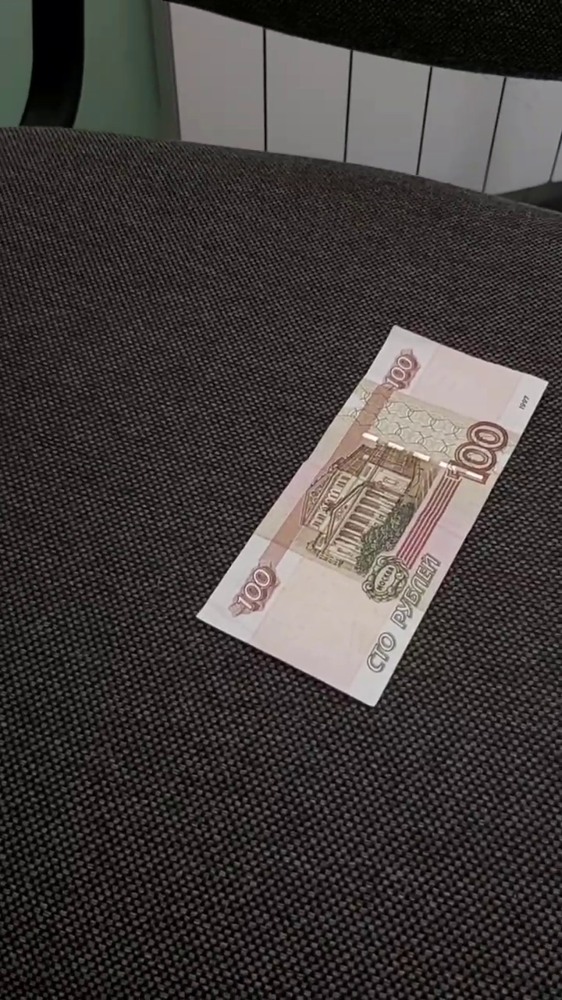

## Работа 5. Детектирование границ документов на кадрах видео
автор: Машуров В. В.
дата: 2022-04-18T14:08:55

### Задание
0. текст, иллюстрации и подписи отчета придумываем самостоятельно
1. используем данные из лаб. 4
2. выделяем границы и находим внешнюю рамку документа
3. руками изготавливаем векторную разметку (идеальная рамка купюры)
4. оцениваем качество и анализируем ошибки

### Результаты

<table>
    <thead>
        <tr>
            <td>Номер</td>
            <td>Исх. картинка</td>
            <td>Чёрно-белая</td>
            <td>Края</td>
            <td>Маска (Эталон)</td>
            <td>Контуры</td>
        </tr>
    </thead>
    <tbody>
        <tr>
            <td>50р-1</td>
            <td>  </td>
            <td>  </td>
            <td>  </td>
            <td>  </td>
            <td>  </td>
        </tr>
        <tr>
            <td>50р-2</td>
            <td>  </td>
            <td>  </td>
            <td>  </td>
            <td>  </td>
            <td>  </td>
        </tr>
        <tr>
            <td>50р-3</td>
            <td>  </td>
            <td>  </td>
            <td>  </td>
            <td>  </td>
            <td>  </td>
        </tr>
        <tr>
            <td>100р-1</td>
            <td>  </td>
            <td>  </td>
            <td>  </td>
            <td>  </td>
            <td>  </td>
        </tr>
        <tr>
            <td>100р-2</td>
            <td>  </td>
            <td>  </td>
            <td>  </td>
            <td>  </td>
            <td>  </td>
        </tr>
        <tr>
            <td>100р-3</td>
            <td>  </td>
            <td>  </td>
            <td>  </td>
            <td>  </td>
            <td>  </td>
        </tr>
        <tr>
            <td>500р-1</td>
            <td>  </td>
            <td>  </td>
            <td>  </td>
            <td>  </td>
            <td>  </td>
        </tr>
        <tr>
            <td>500р-2</td>
            <td>  </td>
            <td>  </td>
            <td>  </td>
            <td>  </td>
            <td>  </td>
        </tr>
        <tr>
            <td>500р-3</td>
            <td>  </td>
            <td>  </td>
            <td>  </td>
            <td>  </td>
            <td>  </td>
        </tr>
        <tr>
            <td>1000р-1</td>
            <td>  </td>
            <td>  </td>
            <td>  </td>
            <td>  </td>
            <td>  </td>
        </tr>
        <tr>
            <td>1000р-2</td>
            <td>  </td>
            <td>  </td>
            <td>  </td>
            <td>  </td>
            <td>  </td>
        </tr>
        <tr>
            <td>1000р-3</td>
            <td>  </td>
            <td>  </td>
            <td>  </td>
            <td>  </td>
            <td>  </td>
        </tr>
        <tr>
            <td>5000р-1</td>
            <td>  </td>
            <td>  </td>
            <td>  </td>
            <td>  </td>
            <td>  </td>
        </tr>
        <tr>
            <td>5000р-2</td>
            <td>  </td>
            <td>  </td>
            <td>  </td>
            <td>  </td>
            <td>  </td>
        </tr>
        <tr>
            <td>5000р-3</td>
            <td>  </td>
            <td>  </td>
            <td>  </td>
            <td>  </td>
            <td>  </td>
        </tr>
    </tbody>
</table>

### Текст программы

```cpp
#include <opencv2/opencv.hpp>
#include <vector>
#include <cmath>

std::string logs = "";
unsigned long long int rightOnes = 0;

cv::Mat bgrToGrayscale(const cv::Mat& img_bgr) {
    cv::Mat img_grey;
    cv::resize(img_bgr, img_grey, cv::Size(img_bgr.cols / 2, img_bgr.rows / 2), 0.5, 0.5);
    cv::GaussianBlur(img_grey, img_grey, cv::Size(5, 5), 1.);
    cv::blur(img_grey, img_grey, cv::Size(3, 3));
    cv::cvtColor(img_grey, img_grey, cv::COLOR_BGR2GRAY);
    return img_grey;
}

cv::Mat edDetect(const cv::Mat& img_grey) {
    cv::Mat eddetect;
    cv::Canny(img_grey, eddetect, 100., 200.);
    return eddetect;
}

cv::Mat findRightContours(const cv::Mat& eddetect) {
    cv::Mat res = cv::Mat::zeros(eddetect.rows, eddetect.cols, CV_8UC3);
    std::vector<std::vector<cv::Point> > contours;
    std::vector<cv::Vec4i> hierarchy;

    cv::findContours(eddetect, contours, hierarchy,
        cv::RETR_EXTERNAL, cv::CHAIN_APPROX_SIMPLE);

    int idx = 0;
    int the_biggest_rec_idx = 0;
    double area = 0.;
    for (; idx >= 0; idx = hierarchy[idx][0])
    {
        if (cv::contourArea(contours[idx]) > area) {
            area = cv::contourArea(contours[idx]);
            the_biggest_rec_idx = idx;
        }
    }

    cv::Scalar color(rand() & 255, rand() & 255, rand() & 255);
    cv::drawContours(res, contours, the_biggest_rec_idx, color, cv::LINE_4, 8, hierarchy);

    return res;
}

void imageProcessing(cv::Mat img_png, const std::string SAVEPATH, const std::string SOURCESPATH) {
    cv::Mat img_grey = bgrToGrayscale(img_png);
    cv::Mat eddetect = edDetect(img_grey);
    cv::Mat contours = findRightContours(eddetect);

    logs += SAVEPATH + "img_bgr.png" + '\n';

    imwrite(SAVEPATH + "img_bgr.png", img_png);
    imwrite(SAVEPATH + "img_grey.png", img_grey);
    imwrite(SAVEPATH + "eddetect.png", eddetect);
    imwrite(SAVEPATH + "contours.png", contours);
}

// Sorry, I know it's a bad manner but I don't want to look up for docs for this...
std::vector<char> chars = { '0', '1', '2', '3', '4', '5', '6', '7', '8', '9' };
char charIt(int number) {
    return chars.at(number);
}

void videoProcessing(const std::string PATHSOURCES, const std::string FILENAME, const std::string SAVEPATH, const std::ptrdiff_t FRSIZE = 3) {
    cv::VideoCapture capture(PATHSOURCES + FILENAME);
    unsigned long long int video_size = capture.get(cv::CAP_PROP_FRAME_COUNT);
    std::vector<cv::Mat> imgS_png(FRSIZE);

    for (std::ptrdiff_t i = 0, j = 0; j < 3; i += (video_size / 4), j += 1)
    {
       capture.set(cv::CAP_PROP_POS_FRAMES, i);
       capture >> imgS_png.at(j);

       std::string save_to = SAVEPATH + charIt(j + 1) + "/";
       std::string get_from = PATHSOURCES + "masks/" + FILENAME + "/" + charIt(j + 1) + "/";

       imageProcessing(imgS_png.at(j), save_to, get_from);
    }
}

int main() {
    std::vector<std::string> files = { "video50.mp4", "video100.mp4", "video500.mp4", "video1000.mp4", "video5000.mp4" };
    const std::string PATHSOURCES = "../data/";
    const std::string SAVEPATH = "./lab05/";

    for (size_t i = 0; i < files.size(); i += 1) {
        std::string save_path = SAVEPATH + files.at(i) + '/';
        videoProcessing(PATHSOURCES, files.at(i), save_path);
        std::cout << logs;
        logs.clear();
    }

    std::cout << "\nACCURACY = " << rightOnes << " / " << files.size() * 1280 * 720 * 3
        << " = " << ((double)rightOnes / (double)(files.size() * 1280 * 720 * 3)) << '\n' << std::endl;

    return 0;
}
```
