# Работа 5. Детектирование границ документов на кадрах видео
автор: Машуров В. В.
дата: 2022-05-22T19:49:50

github: https://github.com/MVVladimir/mashurov_v_v 

## Задание
0. текст, иллюстрации и подписи отчета придумываем самостоятельно
1. используем данные из лаб. 4
2. выделяем границы и находим внешнюю рамку документа
3. руками изготавливаем векторную разметку (идеальная рамка купюры)
4. оцениваем качество и анализируем ошибки

## Выполнение

### 1. Производим сжатие изображения. 
Производим сжатие изображения в два раза со scale_factor = 0.5 по обоим оосям.
```cpp
cv::resize(img_full, img_short, cv::Size(img_bgr.cols / 2, img_bgr.rows / 2), 0.5, 0.5);
```

### 2. Размываем изображение
Размываем изображение сначала фильтром Гаусса с окном (5, 5) и  Gaussian kernel standart deviation in X direction = 1.0.
Затем производим размытие уже другим фильтром cv::blur с окном (3, 3).
```cpp
cv::GaussianBlur(img, img_, cv::Size(5, 5), 1.);
cv::blur(img, img, cv::Size(3, 3));
```

### 3. Производим цветоредукцию
Можно воспользоваться следующей инструкцией:
```cpp
cv::cvtColor(img, img, cv::COLOR_BGR2GRAY);
```

### 4. Строим карту границ
Воспользуемся детектором границ Кенни:
```cpp
cv::cvtColor(img, edge_map, cv::COLOR_BGR2GRAY);
```

### 5. Найдём на карте границ нужные
Для этого будем использовать метод поиска прямоугольника наибольшей площади. Метод не идеален.

Можно воспользоваться следующей инструкцией:

```cpp
cv::Mat findRightContours(const cv::Mat& eddetect) {
    cv::Mat res = cv::Mat::zeros(eddetect.rows, eddetect.cols, CV_8UC3);
    std::vector<std::vector<cv::Point> > contours;
    std::vector<cv::Vec4i> hierarchy;

    cv::findContours(eddetect, contours, hierarchy,
        cv::RETR_EXTERNAL, cv::CHAIN_APPROX_SIMPLE);

    int idx = 0;
    int the_biggest_rec_idx = 0;
    double area = 0.;
    for (; idx >= 0; idx = hierarchy[idx][0])
    {
        if (cv::contourArea(contours[idx]) > area) {
            area = cv::contourArea(contours[idx]);
            the_biggest_rec_idx = idx;
        }
    }

    cv::Scalar color(rand() & 255, rand() & 255, rand() & 255);
    cv::drawContours(res, contours, the_biggest_rec_idx, color, cv::LINE_4, 8, hierarchy);

    return res;
}
```
Здесь, eddetect - карта границ полученная детектором Кенни.

### 6. Найдём углы документа

Для этого воспользуемся Shi-Tomasi Corner Detector. 
Для этого можно воспользоваться следующей инструкцией:

```cpp
std::vector<cv::Point2f> findCorners(cv::Mat& img) {
    int maxCorners = 4;
    std::vector<cv::Point2f> corners;
    double qualityLevel = 0.01;
    double minDistance = 10;
    int blockSize = 3, gradientSize = 3;
    bool useHarrisDetector = false;
    double k = 0.04;

    goodFeaturesToTrack(img,
        corners,
        maxCorners,
        qualityLevel,
        minDistance,
        cv::Mat(),
        blockSize,
        gradientSize,
        useHarrisDetector,
        k);

    return corners;
}
```

Здесь, img - это изображение, прошедшее 5 предыдущих этапов обработки, из которого нам необходимо получить информацию об углах. 
corners - это вектор точек, которые обозначают углы.

### 7. Сравним полученные результаты с эталонными.

В качестве штрафной функции будем использовать отношение максимальной ошибки опеделения угла к периметру прямоугольника.

#### Значения штрафной функции

<table>
    <thead>
        <tr>
            <td>Файл</td>
            <td> Значение штрафной функции</td>
        </tr>
    </thead>
    <tbody>
        <tr>
            <td> "./lab05/video50.mp4/1/" </td>
            <td> 0.323 </td>
        </tr>
        <tr>
            <td> "./lab05/video50.mp4/2/" </td>
            <td> 0.232 </td>
        </tr>
        <tr>
            <td> "./lab05/video50.mp4/3/" </td>
            <td> 0.189 </td>
        </tr>
        <tr>
            <td> "./lab05/video100.mp4/1/" </td>
            <td> 0.186 </td>
        </tr>
        <tr>
            <td> "./lab05/video100.mp4/2/" </td>
            <td> 0.204 </td>
        </tr>
        <tr>
            <td> "./lab05/video100.mp4/3/" </td>
            <td> 0.272 </td>
        </tr>
        <tr>
            <td> "./lab05/video500.mp4/1/" </td>
            <td> 0.346 </td>
        </tr>
        <tr>
            <td> "./lab05/video500.mp4/2/" </td>
            <td> 0.234 </td>
        </tr>
        <tr>
            <td> "./lab05/video500.mp4/3/" </td>
            <td> 0.336 </td>
        </tr>
        <tr>
            <td> "./lab05/video1000.mp4/1/" </td>
            <td> 0.208 </td>
        </tr>
        <tr>
            <td> "./lab05/video1000.mp4/2/" </td>
            <td> 0.260 </td>
        </tr>
        <tr>
            <td> "./lab05/video1000.mp4/3/" </td>
            <td> 0.193 </td>
        </tr>
        <tr>
            <td> "./lab05/video5000.mp4/2/" </td>
            <td> 0.200 </td>
        </tr>
        <tr>
            <td> "./lab05/video5000.mp4/3/" </td>
            <td> 0.160 </td>
        </tr>
    </tbody>
</table>

#### Описание результатов

<table>
    <thead>
        <tr>
            <td> Показатель </td>
            <td> Значение </td>
        </tr>
    </thead>
    <tbody>
        <tr>
            <td> Среднее </td>
            <td> 0.237 </td>
        </tr>
        <tr>
            <td> Среднеквадратическое отклонение </td>
            <td> 0.058 </td>
        </tr>
        <tr>
            <td> Минимальное значение штрафной функции </td>
            <td> 0.160 </td>
        </tr>
        <tr>
            <td> Максимальное значение штрафной функции </td>
            <td> 0.346 </td>
        </tr>
    </tbody>
</table>
           

## Результаты

<table>
    <thead>
        <tr>
            <td>Номер</td>
            <td>Исх. картинка</td>
            <td>Чёрно-белая</td>
            <td>Карта границ (Кенни)</td>
            <td>Карта границ (после отсева ненужных)</td>
            <td>Выходная карта границ /td>
        </tr>
    </thead>
    <tbody>
        <tr>
            <td>50р-1</td>
            <td>  </td>
            <td>  </td>
            <td>  </td>
            <td>  </td>
            <td> 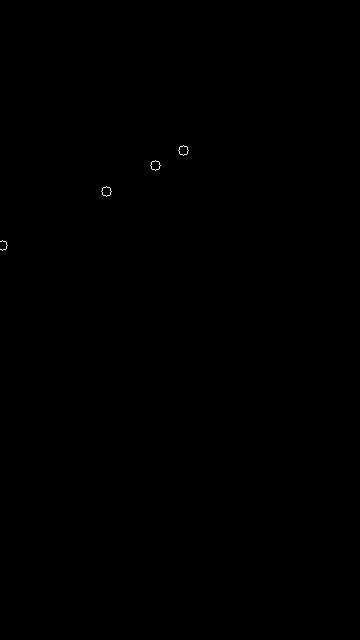 </td>
        </tr>
        <tr>
            <td>50р-2</td>
            <td>  </td>
            <td>  </td>
            <td>  </td>
            <td>  </td>
            <td> 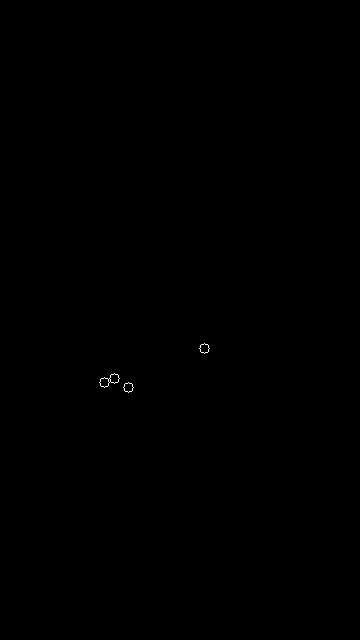 </td>
        </tr>
        <tr>
            <td>50р-3</td>
            <td>  </td>
            <td>  </td>
            <td>  </td>
            <td> 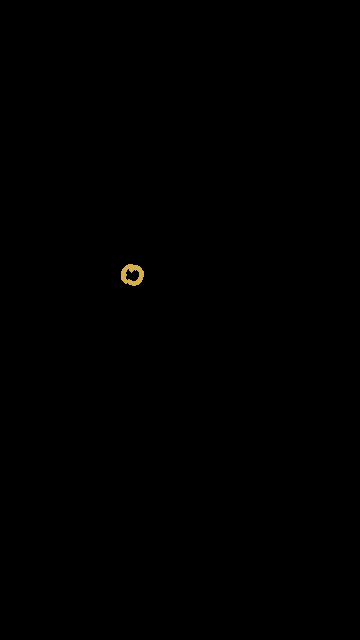 </td>
            <td> 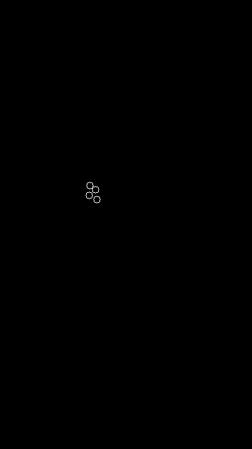 </td>
        </tr>
        <tr>
            <td>100р-1</td>
            <td>  </td>
            <td>  </td>
            <td>  </td>
            <td>  </td>
            <td> 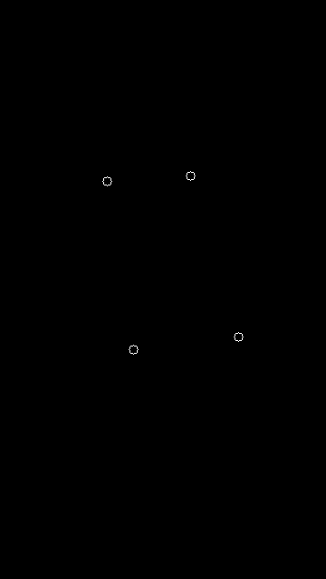 </td>
        </tr>
        <tr>
            <td>100р-2</td>
            <td>  </td>
            <td>  </td>
            <td>  </td>
            <td>  </td>
            <td> 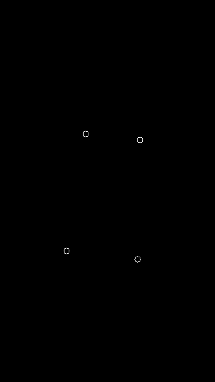 </td>
        </tr>
        <tr>
            <td>100р-3</td>
            <td>  </td>
            <td>  </td>
            <td>  </td>
            <td>  </td>
            <td> 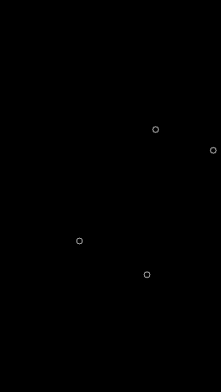 </td>
        </tr>
        <tr>
            <td>500р-1</td>
            <td>  </td>
            <td>  </td>
            <td>  </td>
            <td> 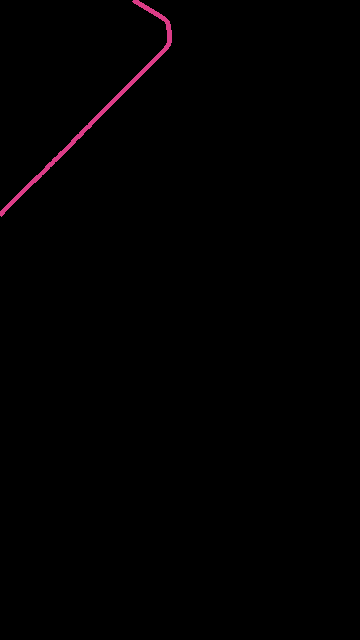 </td>
            <td> 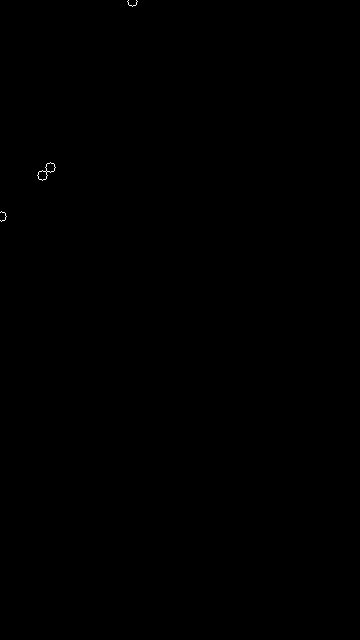 </td>
        </tr>
        <tr>
            <td>500р-2</td>
            <td> 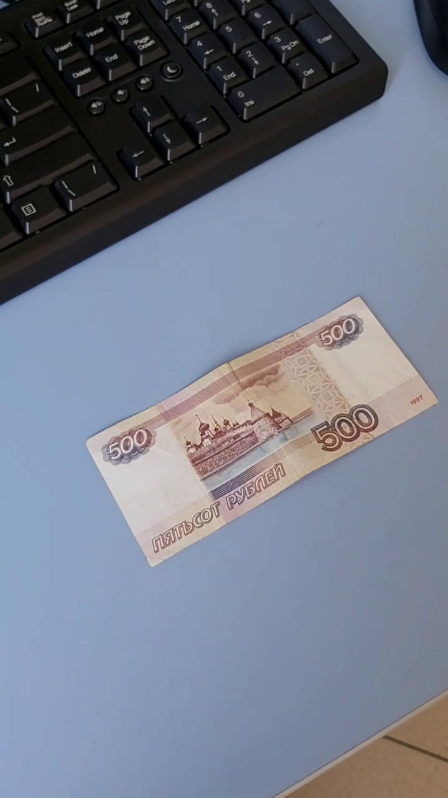 </td>
            <td>  </td>
            <td>  </td>
            <td>  </td>
            <td>  </td>
        </tr>
        <tr>
            <td>500р-3</td>
            <td>  </td>
            <td>  </td>
            <td>  </td>
            <td>  </td>
            <td> 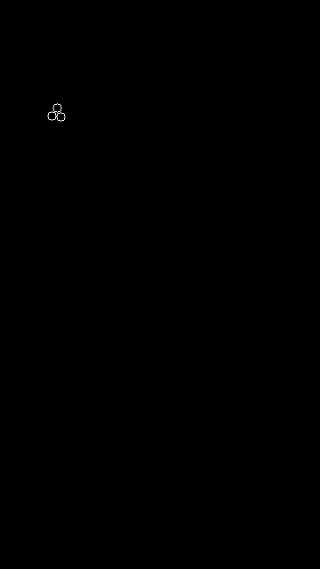 </td>
        </tr>
        <tr>
            <td>1000р-1</td>
            <td>  </td>
            <td>  </td>
            <td>  </td>
            <td>  </td>
            <td> 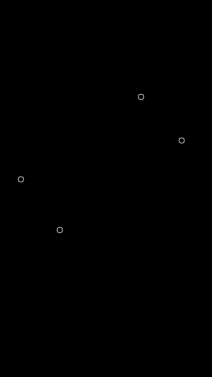 </td>
        </tr>
        <tr>
            <td>1000р-2</td>
            <td>  </td>
            <td>  </td>
            <td>  </td>
            <td>  </td>
            <td> 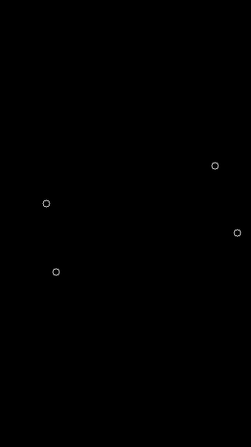 </td>
        </tr>
        <tr>
            <td>1000р-3</td>
            <td>  </td>
            <td>  </td>
            <td>  </td>
            <td>  </td>
            <td> 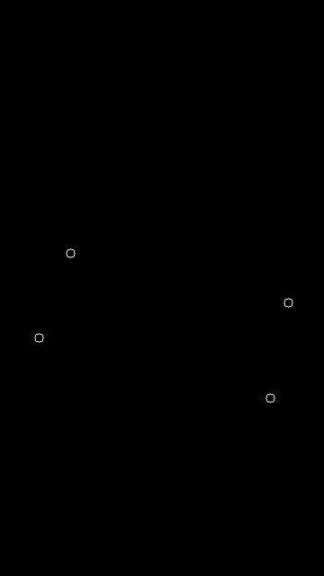 </td>
        </tr>
        <tr>
            <td>5000р-1</td>
            <td>  </td>
            <td>  </td>
            <td>  </td>
            <td>  </td>
            <td> 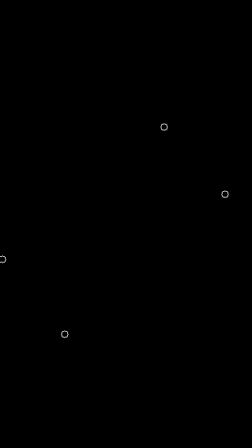 </td>
        </tr>
        <tr>
            <td>5000р-2</td>
            <td>  </td>
            <td>  </td>
            <td>  </td>
            <td>  </td>
            <td> 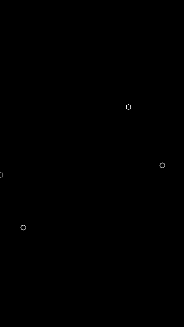 </td>
        </tr>
        <tr>
            <td>5000р-3</td>
            <td>  </td>
            <td>  </td>
            <td>  </td>
            <td>  </td>
            <td> 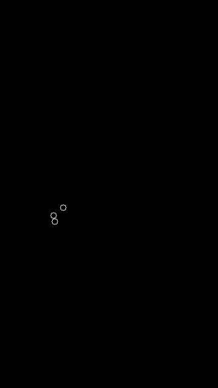 </td>
        </tr>
    </tbody>
</table>

## Текст программы

```cpp
#include <opencv2/opencv.hpp>
#include <vector>
#include <cmath>
#include <nlohmann/json.hpp>
#include <fstream>
#include <limits>

std::string logs = "";
unsigned long long int rightOnes = 0;

std::vector<cv::Point2f> getPointsFromJson(std::string& filePath, const std::string& topTag) {
    std::ifstream inputJSON(filePath);
    nlohmann::json json;
    inputJSON >> json;

    std::map<char, std::vector<int>> mapXY;
    mapXY['x'] = json[topTag]["regions"][0]["shape_attributes"]["all_points_x"].get<std::vector<int>>();
    mapXY['y'] = json[topTag]["regions"][0]["shape_attributes"]["all_points_y"].get<std::vector<int>>();

    inputJSON.close();

    std::vector<cv::Point2f> output;

    for (size_t i = 0; i < mapXY['x'].size(); i += 1)
    {
        output.push_back(cv::Point2f(mapXY['x'].at(i), mapXY['y'].at(i)));
    }

    return output;
}

cv::Mat bgrToGrayscale(const cv::Mat& img_bgr) {
    cv::Mat img_grey;
    cv::resize(img_bgr, img_grey, cv::Size(img_bgr.cols / 2, img_bgr.rows / 2), 0.5, 0.5);
    cv::GaussianBlur(img_grey, img_grey, cv::Size(5, 5), 1.);
    cv::blur(img_grey, img_grey, cv::Size(3, 3));
    cv::cvtColor(img_grey, img_grey, cv::COLOR_BGR2GRAY);
    return img_grey;
}

cv::Mat edDetect(const cv::Mat& img_grey) {
    cv::Mat eddetect;
    cv::Canny(img_grey, eddetect, 100., 200.);
    return eddetect;
}

cv::Mat findRightContours(const cv::Mat& eddetect) {
    cv::Mat res = cv::Mat::zeros(eddetect.rows, eddetect.cols, CV_8UC3);
    std::vector<std::vector<cv::Point> > contours;
    std::vector<cv::Vec4i> hierarchy;

    cv::findContours(eddetect, contours, hierarchy,
        cv::RETR_EXTERNAL, cv::CHAIN_APPROX_SIMPLE);

    int idx = 0;
    int the_biggest_rec_idx = 0;
    double area = 0.;
    for (; idx >= 0; idx = hierarchy[idx][0])
    {
        if (cv::contourArea(contours[idx]) > area) {
            area = cv::contourArea(contours[idx]);
            the_biggest_rec_idx = idx;
        }
    }

    cv::Scalar color(rand() & 255, rand() & 255, rand() & 255);
    cv::drawContours(res, contours, the_biggest_rec_idx, color, cv::LINE_4, 8, hierarchy);

    return res;
}

std::vector<cv::Point2f> findCorners(cv::Mat& img) {
    int maxCorners = 4;
    std::vector<cv::Point2f> corners;
    double qualityLevel = 0.01;
    double minDistance = 10;
    int blockSize = 3, gradientSize = 3;
    bool useHarrisDetector = false;
    double k = 0.04;

    goodFeaturesToTrack(img,
        corners,
        maxCorners,
        qualityLevel,
        minDistance,
        cv::Mat(),
        blockSize,
        gradientSize,
        useHarrisDetector,
        k);

    return corners;
}

double euclidean_metric(cv::Point2f p1, cv::Point2f p2) {
    return std::sqrt(std::pow(p1.x - p2.x, 2.) + std::pow(p1.y - p2.y, 2.));
}

double find_distance_from_nearest_point(std::vector<cv::Point2f> points, cv::Point2f myPoint) {
    double min = std::numeric_limits<double>::max();
    for (auto point : points) {
        if (euclidean_metric(point, myPoint) < min) {
            min = euclidean_metric(point, myPoint);
        }
    }
    return min;
}

double find_perimetr(std::vector<cv::Point2f> points) {
    double P = 0.;
    for (size_t i = 0; i < points.size() - 1; i += 1)
    {
        P += euclidean_metric(points[i], points[i + 1]);
    }
    P += euclidean_metric(points[points.size() - 1], points[0]);
    return P;
}

void imageProcessing(cv::Mat img_png, const std::string SAVEPATH, const std::string SOURCESPATH) {
    cv::Mat img_grey = bgrToGrayscale(img_png);
    cv::Mat eddetect = edDetect(img_grey);
    cv::Mat contours = findRightContours(eddetect);

    cv::Mat contours_gray(contours.size(), CV_8UC1);
    cv::cvtColor(contours, contours_gray, cv::COLOR_BGR2GRAY);

    std::vector<cv::Point2f> corners = findCorners(contours_gray);
    cv::Mat corners_img(contours.size(), CV_8UC3, { 0, 0, 0 });

    std::vector<cv::Point2f> points = getPointsFromJson(SAVEPATH + "ethalon.json", "img_bgr"); 
    double max_err = -1.;

    for (cv::Point2f corner : corners) {
        cv::circle(corners_img, corner, 5, { 255, 255, 255 });
        if (max_err < find_distance_from_nearest_point(points, corner)) {
            max_err = find_distance_from_nearest_point(points, corner);
        }
    }

    double penalty = max_err / find_perimetr(points);

    logs += (SAVEPATH + " : penalty = " + std::to_string(penalty) + '\n');

    imwrite(SAVEPATH + "img_bgr.png", img_png);
    imwrite(SAVEPATH + "img_grey.png", img_grey);
    imwrite(SAVEPATH + "eddetect.png", eddetect);
    imwrite(SAVEPATH + "contours.png", contours);
    imwrite(SAVEPATH + "corners.png", corners_img);
}

// Sorry, I know it's a bad manner but I don't want to look up for docs for this...
std::vector<char> chars = { '0', '1', '2', '3', '4', '5', '6', '7', '8', '9' };
char charIt(int number) {
    return chars.at(number);
}

void videoProcessing(const std::string PATHSOURCES, const std::string FILENAME, const std::string SAVEPATH, const std::ptrdiff_t FRSIZE = 3) {
    cv::VideoCapture capture(PATHSOURCES + FILENAME);
    unsigned long long int video_size = capture.get(cv::CAP_PROP_FRAME_COUNT);
    std::vector<cv::Mat> imgS_png(FRSIZE);

    for (std::ptrdiff_t i = 0, j = 0; j < 3; i += (video_size / 4), j += 1)
    {
       capture.set(cv::CAP_PROP_POS_FRAMES, i);
       capture >> imgS_png.at(j);

       std::string save_to = SAVEPATH + charIt(j + 1) + "/";
       std::string get_from = PATHSOURCES + "masks/" + FILENAME + "/" + charIt(j + 1) + "/";

       imageProcessing(imgS_png.at(j), save_to, get_from);
    }
}

int main() {
    std::vector<std::string> files = { "video50.mp4", "video100.mp4", "video500.mp4", "video1000.mp4", "video5000.mp4" };
    const std::string PATHSOURCES = "../data/";
    const std::string SAVEPATH = "./lab05/";

    for (size_t i = 0; i < files.size(); i += 1) {
        std::string save_path = SAVEPATH + files.at(i) + '/';
        videoProcessing(PATHSOURCES, files.at(i), save_path);
        std::cout << logs;
        logs.clear();
    }

    return 0;
}
```
