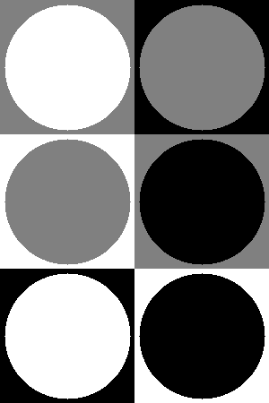
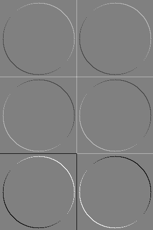
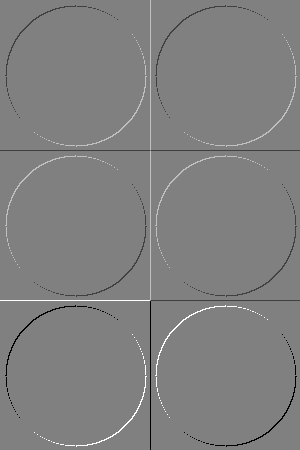

## Работа К. фильтрация изображений

автор: Машуров В. В.

дата: 2022-05-22T19:49:50

хранилище: https://github.com/MVVladimir/mashurov_v_v 

### Задание
0. текст, иллюстрации и подписи отчета придумываем самостоятельно
1. нарисовать
- одноканальное изображение 
- поле 2x3 из квадратных клеток 150x150px черного, белого и серого (127) цвета (соседние цвета разные)
- в цетре клеток - круг другого цвета (все сочетания перебрать)
2. отфильтровать и визуализировать $I_1$ (фильтр вида)
<table>
    <tr>
        <td> 0 </td>
        <td> 1 </td>
    </tr>
    <tr>
        <td> -1 </td>
        <td> 0 </td>
    </tr>
</table>

3. отфильтровать и визуализировать $I_2$ (фильтр вида)
<table>
    <tr>
        <td> -1 </td>
        <td> 0 </td>
    </tr>
    <tr>
        <td> 0 </td>
        <td> 1 </td>
    </tr>
</table>

4. вычислить и визуалиировать геометрическое среднее (корень из суммы квадратов I1 и I2)

### Результаты

#### Исходное изображение (нарисованное)



#### Изображение после применения фильтра $I_1$



#### Изображение после применения фильтра $I_2$



#### Изображение составленное из суммы выходов $I_1$ и $I_2$


### Текст программы

```cpp
#include <opencv2/opencv.hpp>
#include <vector>
#include <cmath>
#include <limits>

#define BLACK 0.
#define WHITE 255.
#define GREY 128.
#define STANDART_SIZE cv::Size(300, 450)

std::vector<cv::Scalar> recs_colours = { GREY, WHITE, BLACK, BLACK, GREY, WHITE };
std::vector<cv::Scalar> circles_colours = { WHITE, GREY, WHITE, GREY, BLACK, BLACK };

int main() {

    cv::Mat img(STANDART_SIZE, CV_32FC1);

    int ri = 0;
    int ci = 0;
    
    //CREATING IMAGE

    for (size_t i = 0; i < img.cols; i += 150)
    {
        for (size_t j = 0; j < img.rows; j += 150)
        {
            cv::rectangle(img, cv::Point(i, j), cv::Point(i + 150, j + 150), recs_colours[ri], cv::FILLED);
            cv::circle(img, cv::Point(i + 75, j + 75), 70, circles_colours[ci], cv::FILLED);
            ri += 1;
            ci += 1;
        }
    }

    cv::Mat filtered1, filtered11, filtered1Viz, filtered2, filtered2Viz;
    cv::Mat filtered12(cv::Size(STANDART_SIZE), CV_32FC1);

    // KERNEL 1

    cv::Mat kernel1(cv::Size(2, 2), CV_32FC1);
    kernel1 = 0.;
    kernel1.at<float>(0, 1) = -1.;
    kernel1.at<float>(1, 0) = 1.;
    cv::filter2D(img, filtered1, CV_32F, kernel1);

    filtered1.copyTo(filtered1Viz);
    for (size_t i = 0; i < filtered1.rows; i += 1)
    {
        for (size_t j = 0; j < filtered1.cols; j += 1)
        {
            filtered1Viz.at<float_t>(i, j) = (filtered1.at<float_t>(i, j) + 256.) / 2.;
        }
    }

    // KERNEL 2

    cv::Mat kernel2(cv::Size(2, 2), CV_32FC1);
    kernel2 = 0.;
    kernel2.at<float>(0, 0) = 1.;
    kernel2.at<float>(1, 1) = -1.;
    cv::filter2D(img, filtered2, CV_32F, kernel2);

    filtered2.copyTo(filtered2Viz);
    for (size_t i = 0; i < filtered2.rows; i += 1)
    {
        for (size_t j = 0; j < filtered2.cols; j += 1)
        {
            filtered2Viz.at<float_t>(i, j) = (filtered2.at<float_t>(i, j) + 256.) / 2.;
        }
    }

    // KERNEL 1 + KERNEL 2

    filtered12 = 0.;
    for (size_t i = 0; i < filtered12.rows; i += 1)
    {
        for (size_t j = 0; j < filtered12.cols; j += 1)
        {
            filtered12.at<float_t>(i, j) += std::sqrt(std::pow(filtered1.at<float_t>(i, j), 2.) + std::pow(filtered2.at<float_t>(i, j), 2.));
        }
    }

    filtered1Viz.convertTo(filtered1Viz, CV_8UC1);
    filtered2Viz.convertTo(filtered2Viz, CV_8UC1);
    filtered12.convertTo(filtered12, CV_8UC1);

    cv::imwrite("./taskK/img.png", img);
    cv::imwrite("./taskk/filtered1Viz.png", filtered1Viz);
    cv::imwrite("./taskk/filtered2Viz.png", filtered2Viz);
    cv::imwrite("./taskK/filtered12.png", filtered12);

    return 0;
}
```
